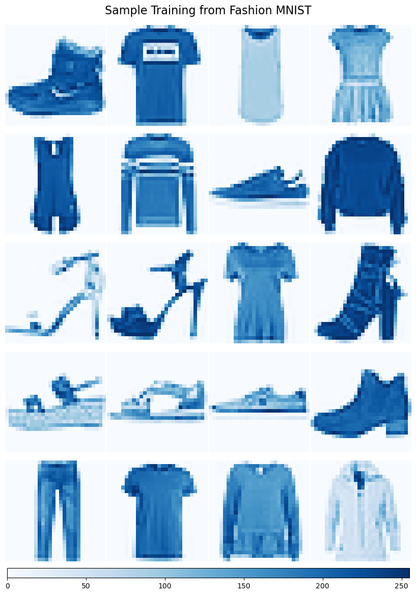

# 👕 Fashion MNIST Classification & PCA Visual Exploration

This project applies machine learning and deep learning to the [Fashion MNIST](https://github.com/mjcolon218/fashion-mnist-exercise) dataset for image classification. In addition to classification with neural networks, it also explores Principal Component Analysis (PCA) to visualize patterns in clothing data.

---

## 📦 Project Overview

- Trained a deep neural network to classify clothing types
- Explored PCA components ("Eigenclothes") for unsupervised structure
- Visualized individual predictions, softmax confidence, and feature space
- Evaluated model performance using a confusion matrix
- Built tools to better understand how image data is processed

---

## 🧠 Concepts Covered

- Image preprocessing (resizing, grayscale, normalization)
- Feedforward Neural Networks for multi-class classification
- PCA for feature compression and visualization
- Model evaluation (accuracy, confusion matrix)
- Interpreting softmax outputs and prediction confidence

---

## 🧪 Sample Visualizations

### 🎨 Eigenclothes (Top PCA Components)
PCA components learned from the image data. These are the directions of greatest variance, visualized as "clothing features".


---

### 🔢 Flattened Pixel View
Every image is stored as a 784-length vector. Here’s what one flattened image looks like:


---

### 📊 Confusion Matrix
Model predictions compared to ground truth. Diagonal = correct predictions.


---

### 🧾 Random Predictions
Predicted vs. true labels for a random sample of images.


---

### 🧷 Sample Clothing Images
A grid view of sample images from the dataset:



---

### 👟 Example Image
This sneaker is encoded as a 28x28 pixel grid, grayscale intensity.


---

## 📁 Folder Structure

```
fashion-mnist/
│
├── model.keras              # Trained model
├── streamlit_app.py         # Optional Streamlit web app
├── pca_analysis.ipynb       # PCA + Eigenclothes code
├── train_eval.ipynb         # Training + evaluation
├── /images                  # Output visuals used in README
└── README.md                # Project documentation
```

---

## 🚀 How to Run

1. Clone the repo
2. Install dependencies:
   ```bash
   pip install -r requirements.txt
   ```
3. Run training or PCA notebooks
4. [Optional] Launch Streamlit app:
   ```bash
   streamlit run cloth-predict.py
   ```

---

## 🧠 Author Notes

This project is designed to teach:
- The basics of image processing in ML
- How PCA can reveal structure in visual data
- Model evaluation and interpretation

Great for students or junior data scientists looking to level up their visual intuition.

---
